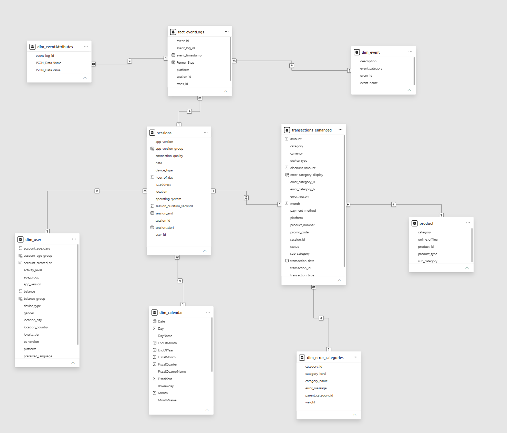
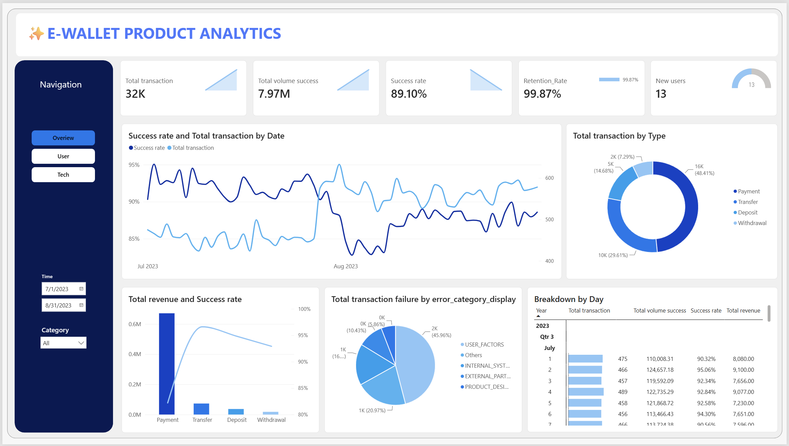
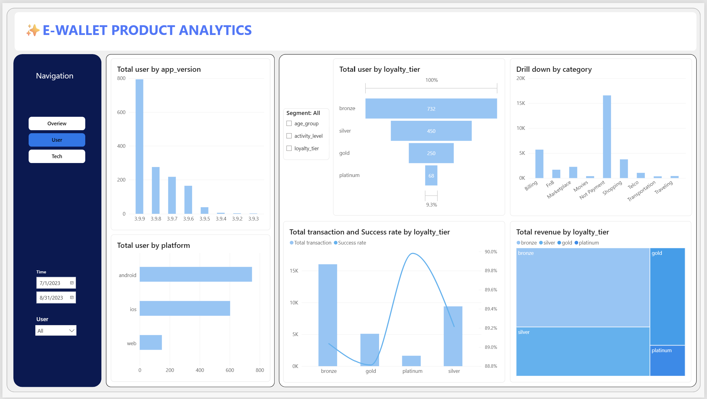
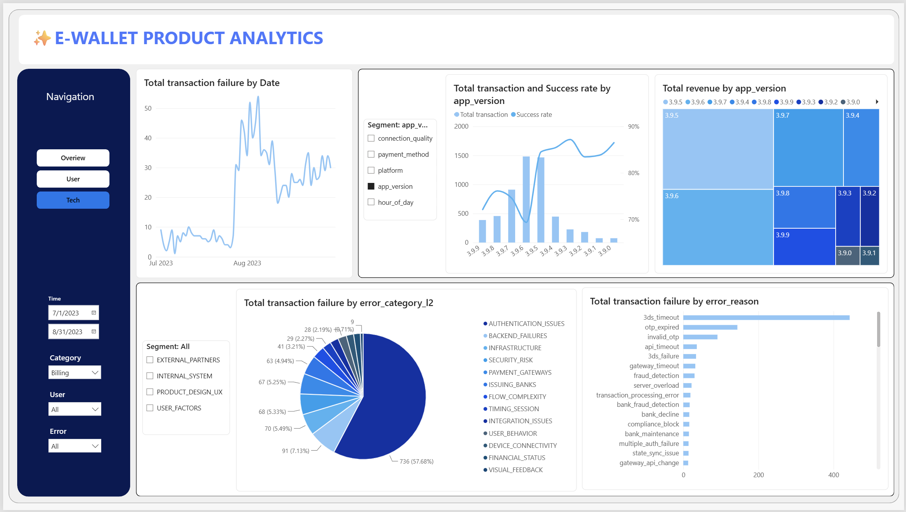

# E-Wallet Payment Success Rate Drop — Root Cause Analysis

A Power BI product analytics project investigating a sudden, sustained drop in bill payment success rate on an e-wallet app starting **July 28, 2023**. The analysis applies the **MECE framework** across transactional, session, event-log, and error data to isolate the failure point in the payment journey — narrowing down from "which segment is failing" to "which exact authentication mechanism is failing, and why."

---

## 🎯 Business Background

Beginning in late July 2023, the product team noticed the app's overall transaction success rate had degraded and was not recovering on its own. Multiple bug-fix releases were shipped, but the metric stayed suppressed. This project answers three questions in sequence:

1. **When** did the drop start, and was it a gradual decline or a step-change?
2. **Where** in the product is it concentrated — a segment, a platform, an app version, a payment method?
3. **Why** is it happening — what is the actual technical failure mechanism, and what fixed it partially vs. not at all?

The investigation covers **July 1 – August 31, 2023**, spanning **32K transactions**.

---

## 🗂️ Data & Structure

---

## 📄 Dashboard Pages

### 1️⃣ Overview

Headline KPIs, the success-rate-vs-transaction-volume trend that first surfaces the July 28 break, revenue and failure composition by transaction type, and a daily breakdown table.

### 2️⃣ User

User base segmented by app version, platform, and loyalty tier, with transaction success rate and revenue cut by loyalty tier to test whether the drop is concentrated in any one user group.

### 3️⃣ Tech

The diagnostic core of the project: failure trend by date, success rate by app_version, and two drill-downs — failure by `error_category_l2` and by `error_reason` — that pinpoint the exact technical mechanism behind the drop.

### 📑 Supporting Report
[`Payment_Success_Rate_Drop_Analysis.pdf`](assets/Payment_Success_Rate_Drop_Analysis.pdf) — the full root-cause write-up referenced throughout this README, including the version-by-version timeout table and final recommendations.

---

## 🔍 Key Insights

### 1. The drop is a step-change on July 28, not a gradual decline
The Overview trend line is flat and stable through late July — **92–93% success rate on July 26–27** — then breaks sharply: success rate falls straight to **~82% on July 28** and never returns to its prior benchmark for the remainder of the observation window. Interestingly, transaction *volume* moves in the opposite direction, jumping higher right as success rate collapses — ruling out a simple "demand overload" explanation, since the system was handling more, not less, traffic when it started failing more often.

**Why this matters:** a step-change points to a specific triggering event (a release, a config change, a partner-side migration) rather than organic degradation, which is exactly the lead the Tech page investigates next.

### 2. The failure is concentrated in Payment → Billing, the company's highest-revenue segment
On the Overview page, **Payment is both the dominant transaction type (48.4% of all transactions) and by far the largest revenue driver** — its revenue bar dwarfs Transfer, Deposit, and Withdrawal combined. The PDF report's category-level gap analysis confirms the drop is not evenly spread: **Billing shows the steepest success-rate decline of any category (-14.5 percentage points between July and August)**, well ahead of Traveling, Movies, or Telco. Within Billing specifically, **Electricity, Internet, and Insurance sub-categories** show the largest declines.

**Why this matters:** the failure hit the segment with the most to lose financially, which is why this became a P1 investigation rather than a minor metric dip.

### 3. User segmentation is a dead end — this is not a "who" problem
The User page and the PDF's segmentation analysis systematically rule out every user-side hypothesis:
- **Age group**: decline is uniform (-14.2% to -15.2%) across all four age bands — no group is protected
- **Loyalty tier**: new users (Bronze, -14.6%) and top-tier users (Platinum, -16.7%) fail at similarly severe rates — rules out an onboarding/new-user-specific bug
- **Network connection**: Excellent connections (-14.8%) fail almost as often as Poor connections (-15.0%) — rules out an ISP/carrier issue
- **Payment method**: failure rates sit in a tight 17–28% band across Credit Card, Debit Card, Linked Bank, and Wallet Balance — no single method is the bottleneck

This is a valuable negative result: it closes off four plausible root causes in one pass and redirects the entire investigation toward the application/backend layer.

### 4. 57.7% of Billing failures trace to one mechanism: authentication timeouts
This is the central finding of the project. Drilling into `error_category_l2` for the Billing segment, **AUTHENTICATION_ISSUES accounts for 736 failures — 57.7% of all Billing failures**, more than the next twelve categories combined. The `error_reason` breakdown decomposes this further into a specific "destructive trio":
- **`3ds_timeout` — 60.2%** of authentication failures
- **`otp_expired` — 19.6%**
- **`invalid_otp` — 12.4%**

Together these three reasons account for **over 90% of all authentication failures**, and by extension, roughly half of all Billing failures overall. The system's own error tagging labels 63.5% of failures as "user factors" — but the L2 drill-down shows this is misleading; the real driver is a technical timeout mechanism, not user behavior.

### 5. The version history tells a story of chasing the wrong fix
This is the most technically interesting insight, and it comes directly from the app_version timeline in the PDF and is visually corroborated by the Tech page's success-rate-by-app_version chart:

| Version | Release | 3ds_timeout rate |
|---|---|---|
| 3.9.0 – 3.9.5 | before July 28 | 0.93% |
| **3.9.6** | **July 28** | **2.77%** ⬆️ (the trigger) |
| 3.9.7 | Aug 5 | 1.58% (partial fix) |
| 3.9.8 | Aug 15 | 1.06% (further improvement) |
| 3.9.9 | Aug 22 (emergency) | **2.00%** ⬆️ (regression) |

Version **3.9.6 is the release that introduced the problem** — it shipped a "decreased memory usage" change that, per the PDF, most likely causes the app to be terminated by the OS in the background while a user is out of the app retrieving their OTP, breaking the authentication session. Versions 3.9.7–3.9.8 progressively relaxed frontend timeouts and clawed back much of the loss. But the **3.9.9 emergency patch went in the wrong direction**: it shortened backend/gateway timeouts without extending the frontend OTP timeout to match, causing `3ds_timeout` to spike back up. The team fixed a client-side memory issue with a server-side timeout change — a mismatch between where the problem lives and where the fix was applied.

### 6. New user acquisition nearly stalled during the incident window
A smaller but notable signal on the Overview page: only **13 new users** were acquired across the entire two-month window, against a retention rate of 99.87%. Retention staying high suggests existing users are not abandoning the app outright, but near-zero new user growth during a period of visible payment failures is a reasonable flag for the growth/marketing team to cross-check against acquisition spend for the same period.

---

## 💡 Recommendations
*(from the supporting PDF report)*

1. **Memory reconfiguration** — Roll back or fine-tune the "decreased memory usage" change shipped in v3.9.6; allocate sufficient RAM to the payment/authentication flow specifically so it isn't the first thing the OS kills in the background.
2. **Session recovery / state preservation** — When the app is reloaded after a user switches away to retrieve an OTP, restore the in-progress payment state instead of forcing a restart that runs into the session timeout.
3. **Frontend-backend timeout synchronization** — Any future timeout change (like v3.9.9's backend adjustment) must be sized against the full frontend OTP/3DS session lifespan, not tuned in isolation. The v3.9.9 regression happened specifically because these two were adjusted independently.

